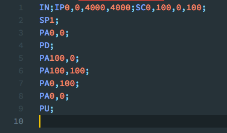

# HPGL Syntax Highlighter

Simple syntax highlighting for HPGL files in visual studio code. Based on the HPGL reference [found here](http://www.isoplotec.co.jp/HPGL/eHPGL.htm).

## Supported file extensions:

* .hgl
* .hpgl